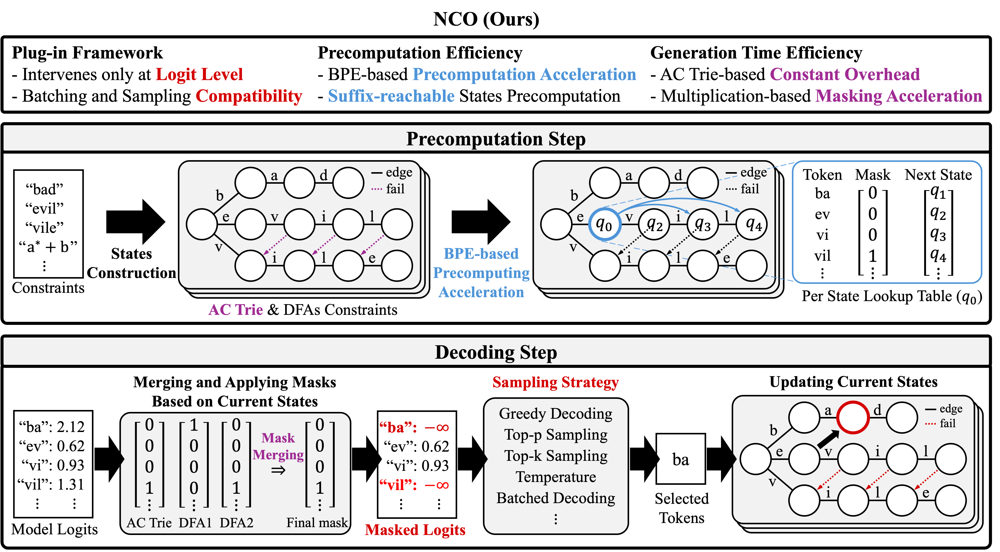
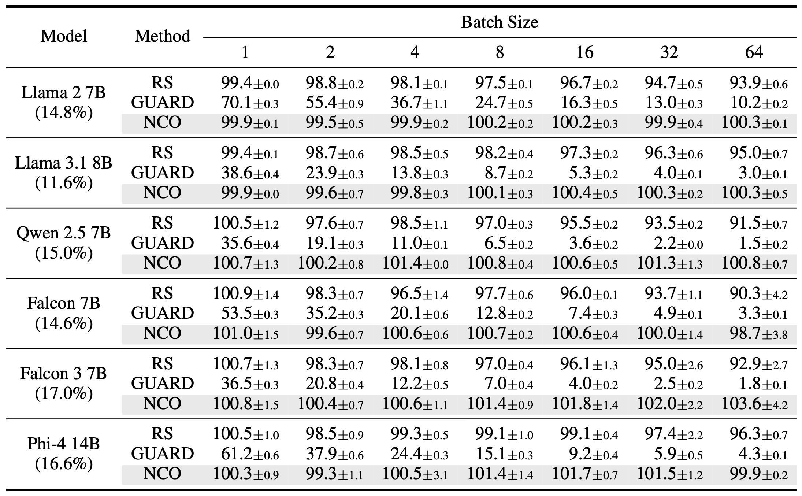
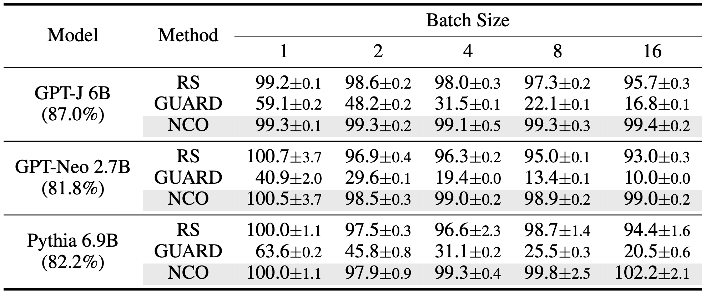
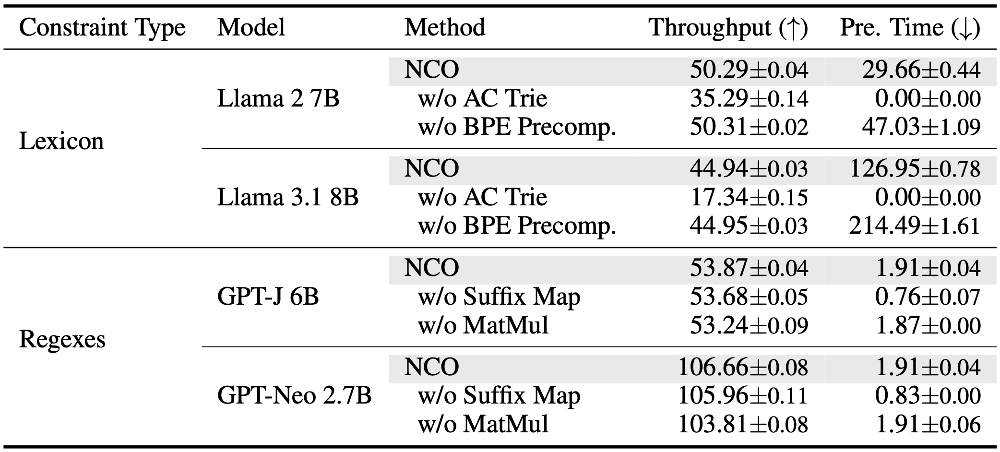

# NCO: A Versatile Plug-in for Handling Negative Constraints in Decoding

<p align="center">
  <a href="https://github.com/hyundong98/NCO-Decoding/stargazers">
    
  </a>
  <a href="https://github.com/hyundong98/NCO-Decoding/commits/main">
    
  </a>
  <a href="https://github.com/hyundong98/NCO-Decoding/graphs/contributors">
    
  </a>
</p>

<div align="center">
    <a href="https://arxiv.org/abs/2605.10065"><b>Paper Link</b>📖</a>
</div><br>



## 📝 TL; DR

**NCO** is a decoding-time plug-in for enforcing negative substring constraints in LLM generation. It prevents forbidden strings and regex-matching substrings from appearing in outputs by masking invalid next-token candidates during decoding, while remaining compatible with standard sampling, beam search, and batched inference.

## 🔍 Overview
NCO is an inference-time constrained decoding framework for preventing forbidden substrings from appearing in LLM outputs. 
Unlike post-processing methods, which detect and edit undesirable spans after generation, NCO intervenes during decoding by masking next-token candidates that would complete a forbidden hard constraint or a substring matching a forbidden regex.
The key idea is to avoid constructing a single global avoidance automaton, which can become impractically large when multiple negative constraints are combined. 
Instead, NCO keeps constraints separate and performs online pattern matching during generation. 
For finite forbidden strings, it uses an Aho-Corasick trie to track partial matches across token boundaries. 
For forbidden regexes, it simulates DFA states in parallel to detect matches that may start at any substring position.
Because NCO operates only at the logits level, it can be plugged into standard generation pipelines without retraining, fine-tuning, or modifying the underlying language model. It is compatible with greedy decoding, sampling-based decoding, beam search, and batched inference.

## ✨ What makes NCO valuable?
- **Negative constraint enforcement during decoding**  
  NCO prevents forbidden strings and regex-matching substrings before they are generated.

- **Handles both strings and regexes**  
  NCO supports finite hard constraints such as profanity lexicons, as well as regex constraints such as email addresses, phone numbers, social security numbers, and credit card numbers.

- **No global automaton construction**  
  Instead of complementing and intersecting multiple substring constraints into one large automaton, NCO maintains compact online matching states and merges token-level masks at each decoding step.

- **Token-boundary aware**  
  Forbidden patterns may be split across multiple BPE tokens. NCO tracks partial matches across token boundaries, so it is not limited to simple token blacklists.

- **Efficient batched generation**  
  BPE-aware precomputation and parallel mask computation reduce decoding-time overhead, allowing NCO to preserve throughput close to unconstrained generation in practical settings.

- **Drop-in compatibility**  
  NCO is implemented as a decoding-time plug-in and can be used with standard Hugging Face-style generation strategies.


## ⚡ Quickstart
Get started in minutes by following these steps. This guide will walk you through setting up the environment, running inference, and evaluating the results.

### Step 1: Clone the Repository
```bash
git clone https://github.com/hyundong98/NCO-Decoding.git
cd NCO-Decoding
```

### Step 2: Set Up the Environment
Create a virtual environment and install the required dependencies.
```bash
pip install -r requirements.txt
```

### Step 3: Prepare Finite Hard Constraints
Prepare the forbidden string constraints used for profanity suppression. This script downloads or preprocesses the lexicon.

```bash
python prepare_hard_negative_constraints.py
```

### Step 4: Run Inference
Run constrained generation with NCO. The example below runs profanity suppression on RealToxicityPrompts using forbidden string constraints. During generation, NCO is applied as a logits processor that masks tokens completing a forbidden substring.

```bash
python run_nco.py \
  --dataset-name RTP \
  --model-pretrained meta-llama/Llama-3.1-8B-Instruct \
  --batch-size 1 \
  --output-dir ./result \
  --seed 42 \
  --max-answer-tokens 256 \
  --num-beams 1
```

### Step 5: Evaluate the Results
Once inference is complete, evaluate the output to check the model's violation rates.
```bash
python violation_rate.py
```

## 🛠️ Setup

### Requirements

To run this project, you need to install the dependencies listed below.

```bash
pip install -r requirements.txt
```

Also, running the following script is required to get the finite hard constraints.

```
python prepare_hard_negative_constraints.py
```

### Models and Datasets

The runner `run_nco.py` loads a Hugging Face causal language model, constructs the negative constraints required by the selected task, applies NCO as a LogitsProcessor during constrained generation, and reports throughput. The supported evaluation tasks are summarized below.

| Dataset name | Purpose | Constraint type |
| --- | --- | --- |
| `RTP` | Profanity suppression on RealToxicityPrompts | Forbidden string constraints |
| `Enron` | PII suppression on Enron emails | Forbidden regex constraints |

## 🚀 Usage

You can use the `run_nco.py` script to run experiments using NCO. The script supports both RTP and Enron.

### Running Profanity Suppression (RTP)

To run the profanity suppression task,

```bash
python run_nco.py \
  --dataset-name RTP \
  --model-pretrained meta-llama/Llama-3.1-8B-Instruct \
  --batch-size 1 \
  --output-dir ./result \
  --seed 42 \
  --max-answer-tokens 256 \
  --num-beams 1
```

### Running PII Suppression (Enron)

To run the PII suppression task,

``` bash
python run_nco.py \
  --dataset-name Enron \
  --model-pretrained EleutherAI/gpt-j-6b \
  --batch-size 1 \
  --output-dir ./result \
  --seed 42 \
  --max-answer-tokens 256 \
  --num-beams 1
```

### Evaluating the Results

After running inference, use the `violation_rate.py` script to assess the model's performance.

```bash
python violation_rate.py
```

## 📈 Results

We evaluate NCO on two practical negative constraint tasks: profanity suppression on RealToxicityPrompts and PII suppression on the Enron Email Dataset.

### Profanity suppression



For finite hard constraints, NCO is evaluated on **6 instruction-following models**: Llama 2 7B, Llama 3.1 8B, Qwen 2.5 7B, Falcon 7B, Falcon 3 7B, and Phi-4 14B. We test batched generation with batch sizes **1, 2, 4, 8, 16, 32, and 64**.
Across these settings, NCO suppresses forbidden strings from a profanity lexicon and achieves zero constraint violations under the evaluated constraints. NCO preserves relative throughput close to the unconstrained base model across batch sizes, while rejection sampling and trie-based baselines show larger throughput degradation as batch size increases.

### PII suppression



For regex constraints, NCO is evaluated on **3 Enron-trained language models**: GPT-J 6B, GPT-Neo 2.7B, and Pythia 6.9B. We test batch sizes **1, 2, 4, 8, and 16**.
This setting is more challenging because the forbidden set is specified by regex patterns rather than finite strings, and matches may begin at arbitrary substring positions. NCO suppresses structured PII patterns such as email addresses, phone numbers, social security numbers, and credit card numbers using parallel DFA simulation. Across the evaluated settings, NCO achieves zero constraint violations and maintains stable throughput close to unconstrained decoding.

### Generation quality

In addition to throughput and violation rate, we evaluate generation quality using perplexity. The results show that perplexity remains at a similar level across NCO, the unconstrained base model, and the baselines. This suggests that exact negative constraint enforcement does not require a substantial degradation in language modeling behavior.

### Ablation findings



The ablation results show that NCO's efficiency comes from complementary components. Aho-Corasick failure links reduce runtime overhead for finite hard constraints, BPE-aware precomputation reduces setup cost, suffix-state precomputation handles matches that begin inside a token, and GPU-based mask aggregation improves regex constraint enforcement.